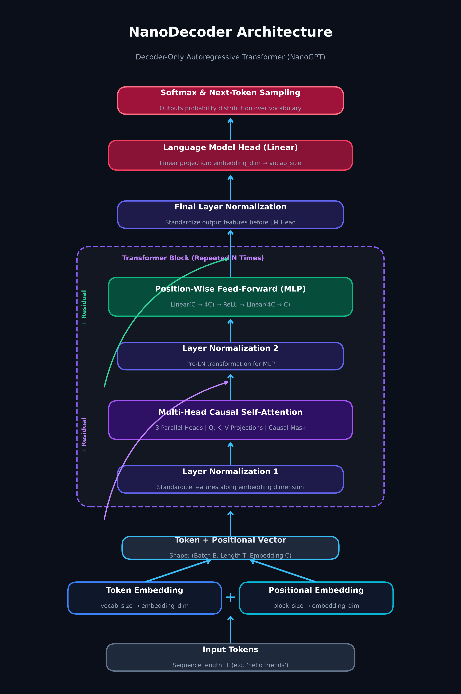

# ⚡ NanoDecoder

A minimal, educational implementation of a **Decoder-Only Causal Transformer Language Model** (`NanoGPT`) built from scratch in **PyTorch**.

Designed to demonstrate tokenization, scaled dot-product multi-head causal self-attention, residual skip connections, layer normalization, cross-entropy training, model checkpointing, and autoregressive text generation.

---

## 🏗️ Architecture Breakdown

### Attention Is All You Need Paper Style Diagram


### Model Flow Diagram


```
Input Tokens
    │
    ├──► Token Embedding (vocab_size -> embedding_dim)
    └──► Learned Position Embedding (block_size -> embedding_dim)
            │
            ▼
    [ Token Emb + Pos Emb ]
            │
            ▼
┌────────────────────────────────────────┐
│  Transformer Block (Repeated N times)  │
│  ├── LayerNorm                         │
│  ├── Multi-Head Causal Self-Attention  │
│  │   └── Scaled Dot-Product (Q, K, V)  │
│  ├── LayerNorm                         │
│  └── Position-wise FeedForward (MLP)   │
└────────────────────────────────────────┘
            │
            ▼
    Final LayerNorm
            │
            ▼
    Language Model Head (embedding_dim -> vocab_size)
            │
            ▼
    Next-Token Probability Distribution (Softmax)
```

### Self-Attention Equation

$$\text{Attention}(Q, K, V) = \text{softmax}\left(\frac{Q K^T}{\sqrt{d_k}} + M\right) V$$

Where $M$ is the causal lower-triangular mask (`tril`) filled with $-\infty$ for future positions to ensure autoregressive prediction.

---

## 📁 Repository Structure

```
.
├── transformer_block.py   # Core PyTorch modules: SelfAttentionHead, MultiHeadAttention, FeedForward, Block
├── demo.py                # Tokenizer, Dataset, NanoGPT model, Training loop, Save/Load, Generation
├── architecture_diagram.png # High-resolution visual diagram of the model architecture
├── .gitignore             # Ignores venv, PyTorch checkpoints, caches, IDE configs
└── README.md              # Project documentation
```

---

## 🚀 Getting Started

### Prerequisites

- Python 3.8+
- PyTorch (CPU or CUDA enabled)

### Installation

1. Clone or download the repository:
   ```bash
   git clone <your-repo-url>
   cd NanoDecoder
   ```

2. Create and activate a virtual environment:
   ```bash
   # Windows
   python -m venv venv
   .\venv\Scripts\activate

   # Linux/macOS
   python3 -m venv venv
   source venv/bin/activate
   ```

3. Install PyTorch:
   ```bash
   pip install torch
   ```

---

## 💻 Running the Demo

Execute `demo.py` to train the model on the toy corpus and run autoregressive text generation:

```bash
python demo.py
```

### Expected Output

```text
Torch version: 2.13.0+cu126
CUDA available: True
GPU name: NVIDIA GeForce GTX 1650

Starting model training...
Step    0 | Loss: 4.9841
Step  300 | Loss: 1.1248
Step  600 | Loss: 0.3631
Step  900 | Loss: 0.2886
Step 1200 | Loss: 0.2309

Generated Text (Trained Model):
hello friends how are you <END> the tea is very hot <END> this tea is extremely...

--- Method A: Saving model weights to 'nano_gpt_weights.pth' ---
Loading model weights from 'nano_gpt_weights.pth' into a fresh NanoGPT instance...
Generated Text: hello friends how are you...

--- Method B: Saving full checkpoint to 'nano_gpt_checkpoint.pt' ---
Loading checkpoint from 'nano_gpt_checkpoint.pt'...
Generated Text: hello everyone hope you are doing well...
```

---

## 💾 Saving & Loading Models

### 1. Saving Weights Only (`state_dict`)
```python
import torch
from demo import NanoGPT

# Save
torch.save(model.state_dict(), "nano_gpt_weights.pth")

# Load
model = NanoGPT()
model.load_state_dict(torch.load("nano_gpt_weights.pth"))
model.eval()
```

### 2. Saving Full Checkpoint (Weights + Vocab + Optimizer)
```python
checkpoint = {
    'model_state_dict': model.state_dict(),
    'optimizer_state_dict': optimizer.state_dict(),
    'word2num': word2num,
    'num2word': num2word,
    'vocab_size': vocab_size,
}
torch.save(checkpoint, "nano_gpt_checkpoint.pt")
```

---

## ⚙️ Model Hyperparameters

| Hyperparameter | Value | Description |
| :--- | :--- | :--- |
| `block_size` | `10` | Maximum context window length (tokens) |
| `embedding_dim` | `32` | Feature vector dimension per token |
| `n_heads` | `3` | Number of parallel attention heads |
| `n_layers` | `3` | Number of Transformer Decoder blocks |
| `lr` | `1e-3` | Learning rate for AdamW optimizer |
| `epochs` | `1500` | Training iterations |

---

## 📜 License

MIT License — feel free to modify and adapt for learning or building custom language models!
